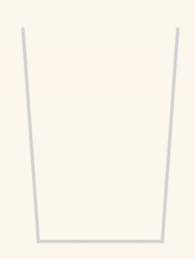
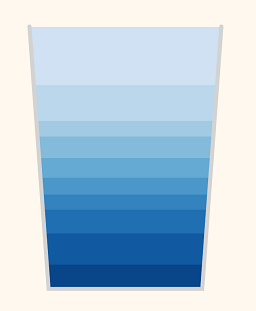
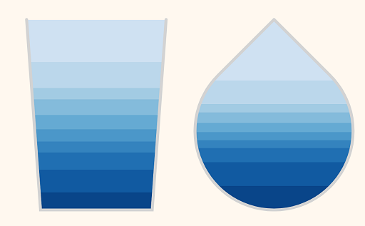
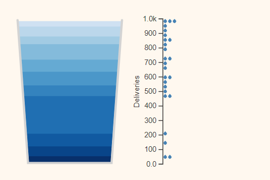
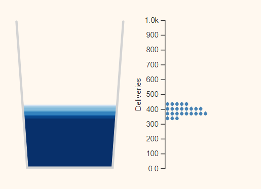

# Bucket Glyph



This repository serves the double purpose of providing code for the Bucket Glyph library and providing example code showing how to use the Bucket Glyph library.

Bucket Glyph is a library of utility functions for rendering bucket glyphs, a heatmap-like visualization for numerical data, as well as quantile histograms, a variation of a classic histogram as explored by [Matthew Kay](https://dl.acm.org/doi/10.1145/2858036.2858558). This codebase is motivated by the [COEQWAL](https://live-coeqwal-ca.pantheon.berkeley.edu/) project's need to visualize water supply data in the California Central Valley in an intuitive way to the general public.

## Features

This library provides utility functions for generating bucket glyphs.



There is also functionality for customizing the shape of the glyph and the level function to accomodate volume differences for irregular shapes.



This library also provides functions for generating quantile histograms that may be used to supplement the bucket visualization.




## Usage

All of the necessary code is found in the `lib` folder and can be copy-pasted to your project. Some important notes:

- This project uses `npm`.
- Bucket Glyph needs [d3js](https://d3js.org/) installed.
- Although this codebase is structured as a React project, React is not needed to use the Bucket Glyph library and is only used to run the example code. See the section on [Running Example Code](#running-example-code) for more information.

Here is a minimal example on how to use Bucket Glyph's library functions:

```js
const liquidLevels = [0, 0.2, 0.4, 0.6, 0.8, 1.0].map(
  (p) => d3.quantile(sortedData, p) / d3.max(sortedData)
);

const glyph = bucketGlyph(width, height);

const liquids = d3
  .select(".graph-area")
  .selectAll(".bucket-box")
  .data(glyph(liquidLevels))
  .join("rect")
  .attr("class", "bucket-box")
  .attr("width", (d) => d.width)
  .attr("height", (d) => d.height)
  .attr("x", (d) => d.x)
  .attr("fill", (_, i) => d3.interpolateBlues(i / 5));

transitionSway(liquids)
  .attr("y", (d) => d.y);
```

Note: you may remove the line with the function `transitionSway` if you do not want to use the liquid-swaying animation.

## Running Example Code

A live demo of the example code can be found [here](https://sarahayu.github.io/bucket-glyph/), but you may run the example code yourself if you wish to make changes to the code. Below are the steps:

1. Download this repository.
2. Run `npm install` in the project's root directory.
3. Run `npm start` to view the application in your web browser.
